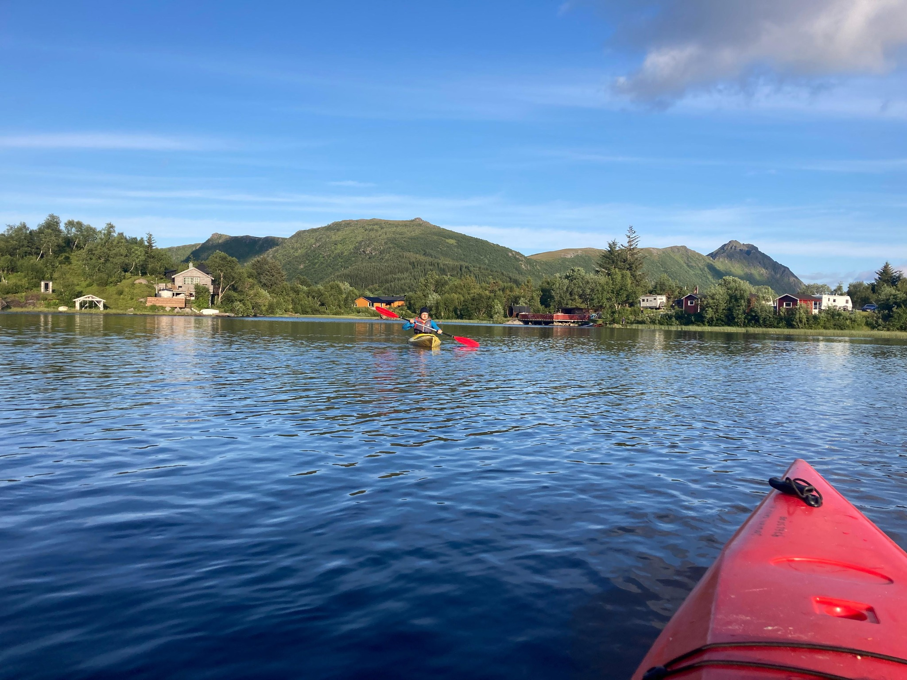

+++
title = "Přechod Lofot z jihu na sever: 11 dní v divočině za polárním kruhem"
date = "2025-07-27T19:36:00+02:00"
draft = false
description = "Trek přes lofotské ostrovy od Moskenes po Svolvaer. 10 nocí pod stanem, bažiny, náročné cesty a nádherná divočina."
tags = ["Norsko", "trek", "Lofoty", "divočina", "backpacking"]
categories = ["Treky"]
featured_image = "featured.jpg"
+++

Přechod Lofot z jihu na sever (Moskenes → Svolvaer) se stal jedním z nejnáročnějších, ale zároveň nejkrásnějších treků, které jsem kdy absolvovala.
**10 nocí pod stanem, 110+ km pěšky, 30+ km stopování** a spousta nezapomenutelných zážitků.

<!--more-->



## Příprava a start

Večeře a snídaně na 10 dní jsme si nesli na zádech a spoustu jídel jsme si doma nasušili. Hlavně domácí sušené Chilli con carne a kuřecí kari, sušené hovězí a kuřecí maso.

*Naše snídaně a večere s sebou - batohy měly bez vody 16 kg.*

Toto není žádný oficiální trek a s trasou jsme se inspirovali na stránkách neznámého člověka. Plní síly vyrážíme z **Moskenes** a ještě si děláme srandu, že nepůjdeme po turistické červené, ale vezmeme to čárkovanou cestou, aby to byla "větší divočina". To ještě netušíme, že v dalších dnech se nám po červené bude stýskat! 😃

Stany stavíme s výhledem na **nejvyšší horu Lofot, Hermanndalstidnen**, na kterou si máme v plánu také "odskočit". Je dost strmá a normálka je místy ještě pod sněhem, tak vyhraje zdravý rozum a nepokoušíme se o ní bez potřebné výbavy.

*Naše místo na stan s výhledem na nejvyšší horu Lofot.*

## Den č. 2: Very difficult path

Nejnáročnější den treku! Sestupujeme cestou označenou v mapě jako **"very difficult path"** a říkáme si, že jsme to měli jít naopak. 😃

*Téměř lezecké kroky a přelézání obřích boulderů*

**Téměř lezecké kroky, přelejzání obřích boulderů a brodění se džunglí a bažinama** - 1 km jsme ušli za 2 hodiny. Tímto tempem to nedáme ani do Vánoc…  4. den zjišťujeme že už jsme asi tak 30 km pozadu za plánem. Kdo byl ten člověk co napsal ten článek?… 😃 Musíme zakomponovat více stopování po silnicích, abychom si užili ty hezké části a mohli vynechat silnice. Přechod Lofot je logisticky nemožný bez trajektů, podzemního tunelu a chůze po silnici, protože se jedná o souostroví.

## Poznávání lofotského terénu

Po prvních dnech jsme se začali orientovat v lofotském terénu:

- **Natěžko nechceme neznačené cesty**
- Rozdíl mezi červenou plnou a červenou čárkovanou je obrovský
- Poznáváme **indikátory bažiny** - bažinné kytky

*Bažinné kytky - vypadají krásně, ale když šlápnete tam kde rostou, vcucne vám bažina botu! 😃*

### Nádherné pláže

Stany rozděláváme na nádherné **pláži Horseidvika**, ke které jsme si trošku zašli. V dalších dnech také jdeme přes pláž **Kvalvika**, která je známá z uměleckého surfovacího filmu *North of the Sun* (film doporučuji!). Bohužel film z ní udělal turistické místo a bylo tam asi tak 25 stanů... Tomu místu na spaní se doporučuji vyhnout, pokud chcete být v divočině.

*Naše stany na pláži Horseidvika s výhledem na fjord*

## Rest day v Leknes

Stopujeme přes asfaltové úseky do největšího města Lofot, **Leknes**, doplňujeme zásoby a dáváme si rest day v kempu.

*Kempy u fjordů mají zdarma k půjčení kajaky! 🛶*

V sámošce kupujeme **místní uzené lososy a makrely v konzervě** - v Norsku ryby fakt stojí za to.

## Horské sekce a hobití chatičky

Zbytek treku už byl v pohodě, zvolnili jsme tempo a užívali si sekce v horách. Po cestě jsou sem tam různé **hobití chatičky porostlé trávou**, ve kterých se dá zdarma spát.

*Tradiční norská chatička s travnatou střechou*

Jsou v nich také kamínka a je tam dřevo. Nakonec jsme v takové spali jen jednou.

## Mořský svět a Matmora Ridge

Celodenní silný déšť přečkáváme v pláštěnce a návlekách a schováváme se v **mořském světě v Kabelvågu**, dozvídáme se o lofotské floře a fauně.

Poté nás čeká stopování na sever do Delp, kde budeme přecházet hřeben **Matmora Ridge** - je ale pod mlhou a moc z něj nevidíme.

*Matmora ridge - moc jsme ho neviděli, protože celý vršek byl v mlze.*

## Finální výstup a sestup do Svolvaeru

Zbytek přechodu už se krásně vine a v posledním výšvihu před **Svolvaerem** narážíme na sníh a zamrzlé jezero.

*Noc u jezera, ve kterém se koupeme večer i ráno.*

**Koupeme se v ledové vodě jak večer, tak ráno.** Když jste x dní bez sprchy, tak opláchnout se v jezeře je fakt bonus, ať je voda sebevíc ledová.

## Technické problémy a finále

Dva dny před koncem se mi **odtrhává podrážka od pohorky**, kterou vcucla bažina, a situaci řešíme tejpou. 😁

*Tejpová oprava - když bažina vyhraje nad botou*

Poté již finální sestup do civilizace a cesta trajektem zpět do **Bodø** - brány do Lofot. Tím skončila naše výprava.

## Závěrečné hodnocení

Když bych přechod Lofot srovnala třeba s islandským přechodem duhových hor, ten byl oproti tomu logisticky jednoduchý a cesty a terén jasné a schůdné.

*Jeden z častých pohybů na Lofotech, tzv. prdeláč 😀*

Ze všech dálkových treků mi Lofoty přišly **psychicky a fyzicky nejtěžší.**

*Poslední sestup do Svolvaer - civilizace je na dosah*

A nutno říct, že jsme na místní poměry měli opravdu **luxusní počasí** a skoro nám nepršelo. Od počasí se trek určitě odvíjí - spousta z těch úseků by za deště byla nebezpečná, neschůdná, nebo by z nich byla klouzačka.

I po několikadenním suchu jsme se bořili po kotníky v blátě. **Ale jinak je to nádherná krajina, drsná a odlehlá.**

