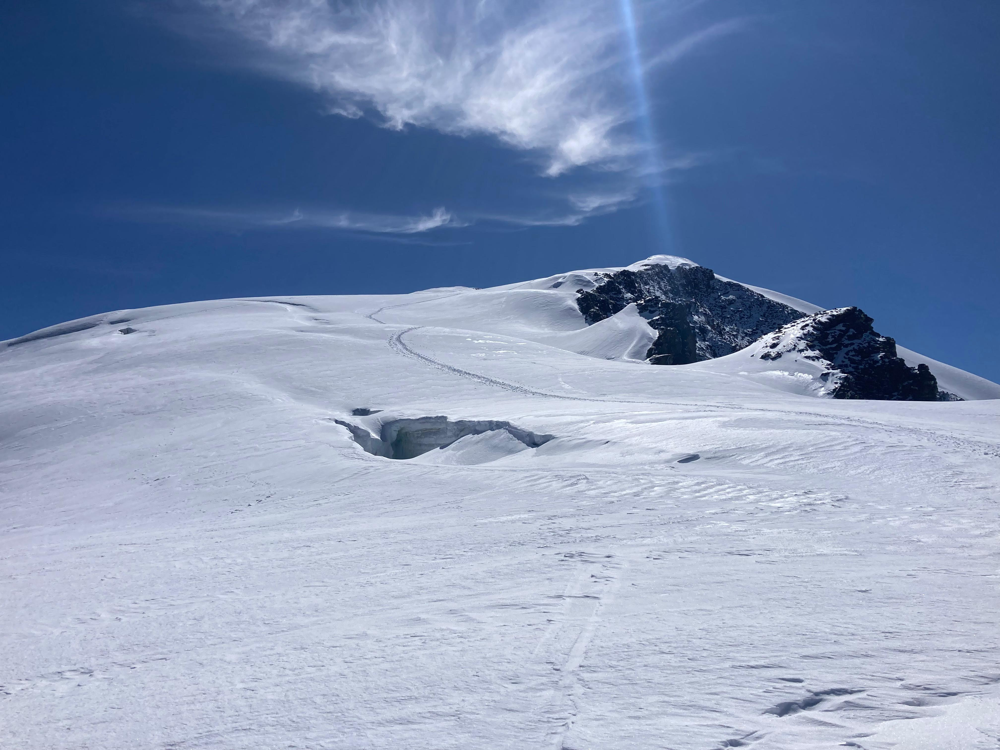
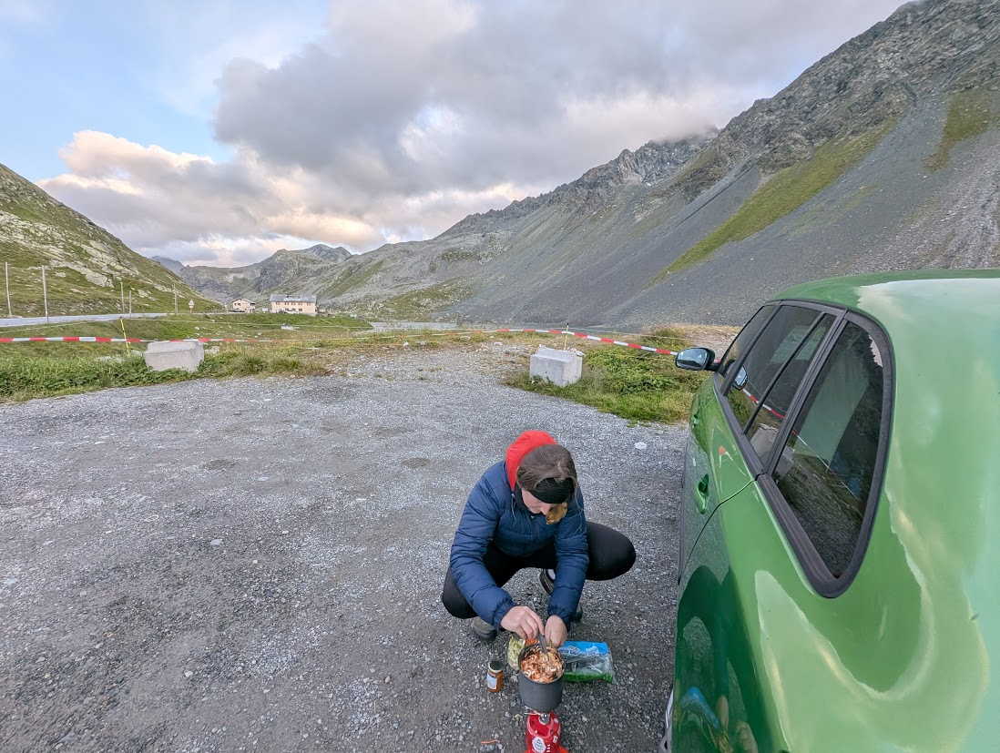
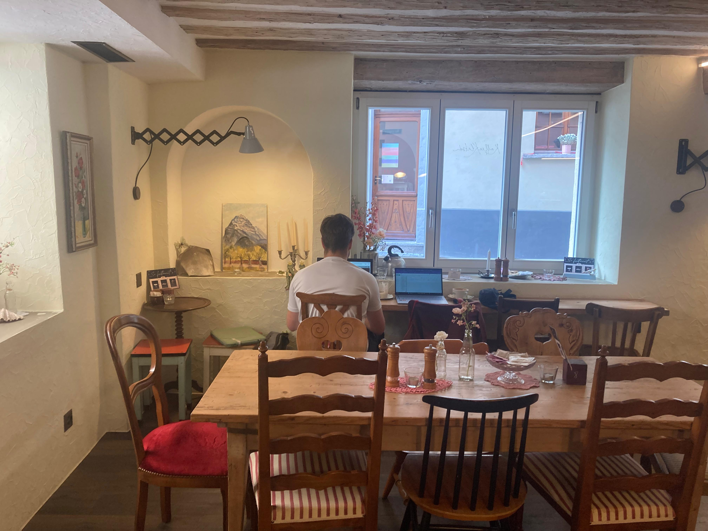
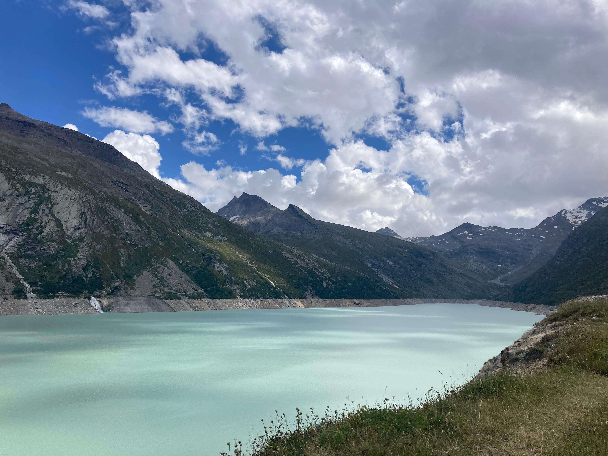
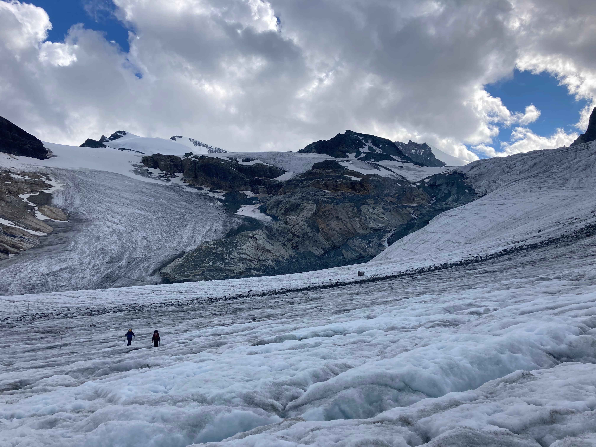
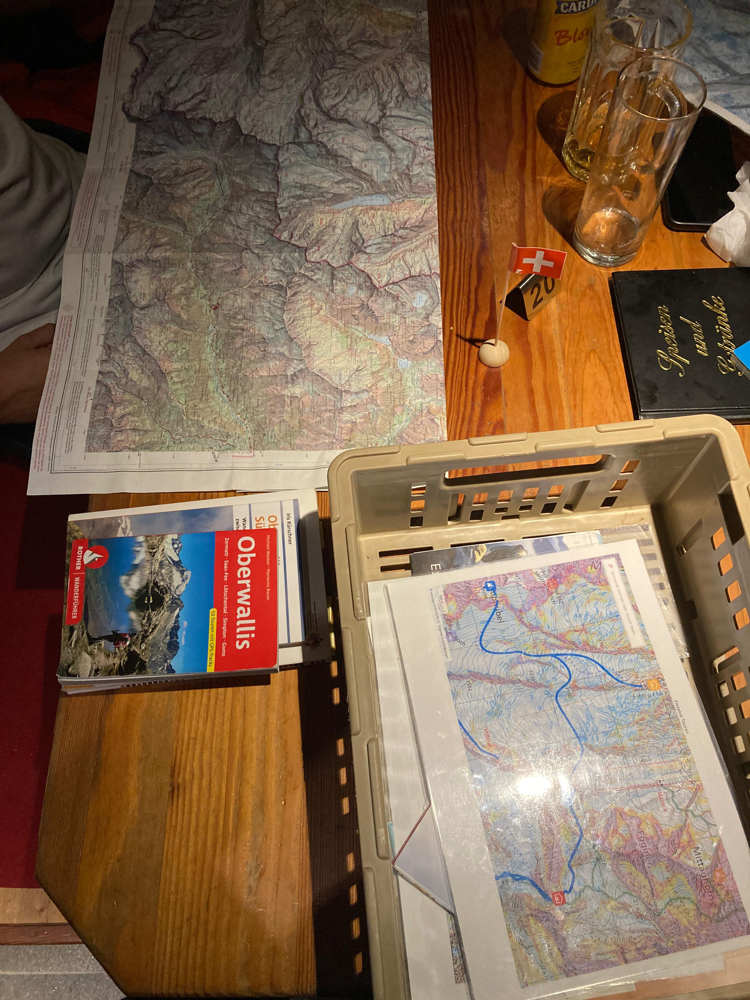
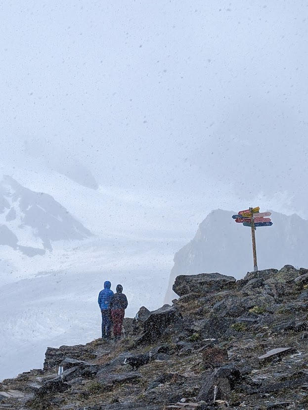
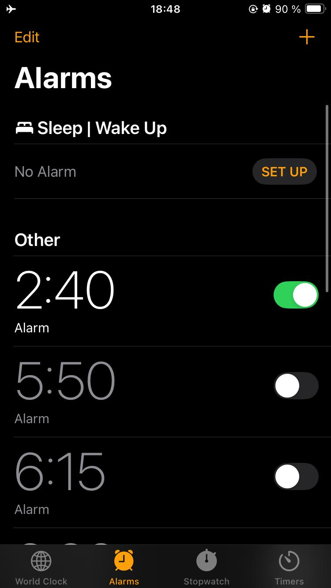
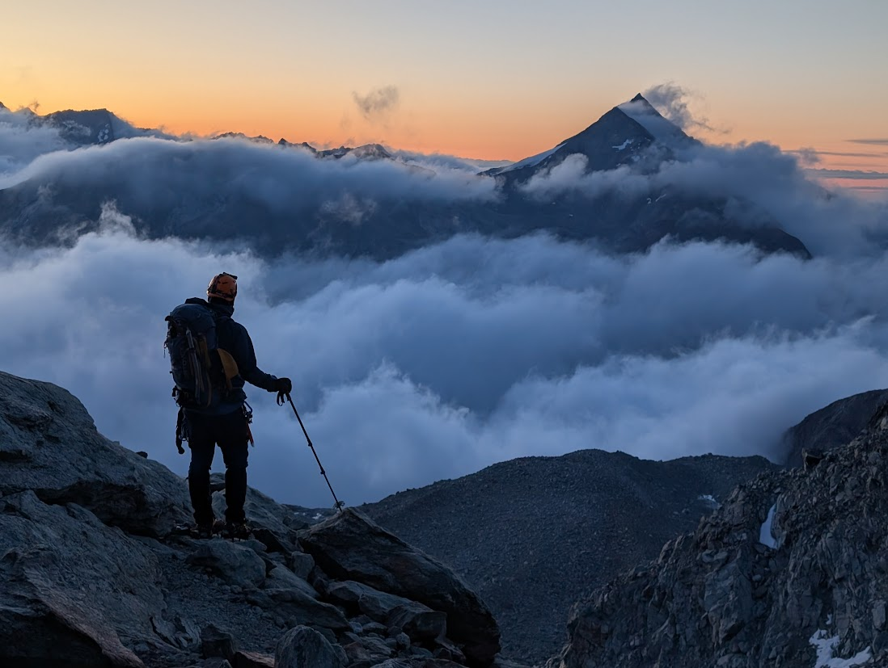

+++
title = "Strahlhorn 4190 m 8/2025" 
date = "2025-08-12T19:36:00+02:00"
draft = false 
description = "Výstup na čtyřtisícovku Strahlhorn ve švýcarském Wallisu. Tento vrchol je preferovaný především v zimě na skialpech, kvůli délce a táhlosti výstupu, ale také kvůli trhlinám." 
tags = ["Čtyřtisícovky", "trek", "Švýcarsko", "horolezení", "výstupy"] 
categories = ["Výstupy"] 
featured_image = "vychod_slunce_strahlhorn.jpg" 
+++

## „Další čtyřtisícovka? Minule jsem přísahala, že je to naposled…“

Ale jak už to tak bývá, člověk rychle zapomíná na všechny krušné chvíle, které v horách zažil. Zbydou jen ty krásné vzpomínky. A tak se po nějaké době znovu přistihne, jak plánuje další srandu na horách... Tentokrát padla volba na švýcarský Saas Grund. 

Proč? 

Protože tam mají díru v systému. 

Pokud přespáváte v kempu, máte drahé lanovky v celém údolí zdarma. 

Ano, čtete správně. 

Plán byl tedy jasný, levný výlet na čtyřtisícovku ve Švýcarsku bez nutnosti prodávat ledvinu. 

Jako obvykle jsem Martina opět nalákala na vidinu „lowcostového výletu“. 

Do party se přidali Andy a Mára, ostřílení borci, se kterými jsem se poznala na Mountain Academy a byli jsme spolu na Wildspitzi. Ideální parta!

## Spaní na Furce a výšlap natěžko na Britannia Hütte

Ve čtvrtek po práci vyrážíme z Innsbrucku míříme vstříc Švýcarsku. Přenocujeme klasicky na Furka Passu, spaní v autě zadarmo, jak jinak. Na vařiči vaříme udon nudle s tuňákem a sušenými rajčaty a strouháme si na ně čerstvý parmezán. To by šlo! 

Telefony máme od hranic přepnuté do režimu letadlo, nechceme riskovat připojení se na švýcarská data. Na pátek máme naplánovaný pracovní den, takže jsem předem vybrala kavárnu v Brigu. A byla to trefa. Mají tam zásuvky, rychlý internet a milou obsluhu. 

Ideální coworking pro nomády. Pracujeme v téměř prázdné kavárně za cenu jednoho kafe. 

Původní plán spát v kempu nakonec měníme a místo toho si rezervujeme nocleh v matrazenlageru na Britannia Hütte. Rozhodujeme se vylézt k chatě bez pomoci lanovek. Podaří se nám domluvit spaní bez polopenze. Když trávíte skoro každý víkend v horách, začne se polopenze trochu prodražovat. Takže bereme vařič a jídlo na tři dny, naházíme všechno do batohů a vyrážíme pěšky od nádrže Mattmark.

Na chatu musíme překonat cca 1000 výškových. Cestou přecházíme zbytky dvou ledovců, ale není se čeho bát, trasa je dobře vyznačená tyčemi a bez trhlin.

## Wintráč, drahá voda a sněžení

Na chatě nás šoupli do winterraumu – jackpot! 

Můžeme si v klidu uvařit venku a sníst to u stolu. Abychom alespoň podpořili chatu, dáváme pití, mastíme s Andy a Márou karty a domlouváme plány následujících dní. 

Zjišťujeme, že na chatě je vážný nedostatek pitné vody. Vodu sem dovážejí vrtulníkem a cena za jednu lahev nás trochu zaskočila. Na dotaz, kolik stojí, slečna řekla něco jako 14 franků. 

Nebo snad 40? 

Těžko říct. 

Ať je to tak či tak, začali jsme si pro vodu chodit k ledovci. Trochu delší cesta, ale zato voda zdarma. Voda je lehce načervenalá, tak ji raději vždy převařujeme. Náš sobotní plán byl dát si aklimatizační výstup, ale počasí nám nepřeje, od rána sněží, fouká vítr, malá viditelnost. Nikomu se do tohoto počasí moc nechce. Procházíme se tedy v okolí, zajišťujeme vodu a obhlížíme trasu na neděli.

V sobotu jsme si šli detailně prohlédnout trasu plánovanou na neděli. Podle mapy vede od chaty trochu nelogicky, nejprve přes ledovec Hohlaubgletscher, zprvu celkem kompaktním, poté přichází zóna trhlin a pak se zase zkompaktní. Následuje strmější výšvih na skalní hřebínek, který je potřeba přejít, a poté sestup traverzem v suťovém poli. Odtud se napojujete na ledovec Allalingletscher, jehož dolní část je proťatá obrovskými trhlinami. Cesta se napojuje v místě, kde už je trhlin méně.

Dolní část jsme si důkladně obhlédli a shodli jsme se: tudy jít nechceme. 

Ledovec je rozpraskaný a pro nás těžko čitelný. Nevíme, jestli tam vůbec vede aktuálně nějaká cesta. 

Jestli ano, tak ji nevidíme.

## Ranní start, trhliny a východ slunce nad hřebínkem

Budík zvoní ve 2:40 ráno. 

Vstáváme a venku si vaříme vodu na kaši. Krátce před čtvrtou ranní už stojíme připraveni před chatou. Lano máme naměřené a nachystané už ze soboty, kdy jsme si trénovali vytahování z trhliny a práci s lanem, abychom si vše znovu osvěžili. 

Mám z nás radost. 

Jsme dobře připravení i aklimatizovaní, dvě noci ve výšce kolem 3000 m, plus přespání na Furce, udělaly svoje. 

Když vyrážíme, vidíme dvě družstva před námi. Ale záhy si všímáme, že jdou úplně jinam než my, míří na spodní část rozervaného Allalin ledovce. Netušíme kam tam míří, protože ani za denního světla jsme tam cestu nenašli, natož teď za tmy jen s čelovkami. 

Držíme se tedy našeho směru přes ledovec Hohlaubgletscher a následně přes skalní hřebínek. Cestou potkáváme další dvě družstva, která se vydávají na hřeben Hohlaubgrat směrem na Allalinhorn. Jejich trasa vede po pravé straně ledovce a brzy nám mizí ve tmě.

Na Hohlaubgletscheru bezpečně přecházíme zónu s trhlinami. Jakmile se blížíme k lehkému hřebínku, odvazujeme se, abychom ho mohli pohodlně přejít. A právě při přechodu nás vítá východ slunce. Zasněžené hory kolem nás se zbarvují do oranžova a Strahlhorn v dálce září v ranním světle. 

Pokračujeme dál po táhlém ledovci směrem k Adlerpassu, sedlu mezi Strahlhornem a Rimpfischhornem. 

Na místě kde se připojujeme na Allalin ledovec necháváme nepotřebné cajky jako je vařič a bomba a další těžké věci a pak se vydáváme na dlouhý a táhlý postup po ledovci směrem nahoru. 

Před sebou vidíme zmíněná dvě družstva. Oni ten ledovec Allalin spodem prošli za tmy? 

Fakt netušíme kudy, ale když to prošli oni, tak my to musíme projít na cestě zpátky taky. 

Celá cesta z chaty na vrchol má cca 8 kilometrů jedním směrem a téměř 1300 výškových metrů převýšení. Po výstupu navíc musíme sestoupit až k autu, protože v pondělí musíme pracovat. A tak přichází náš geniální plán, že to pak sejdeme po ledovci Allalin dolů a napojíme se rovnou na trasu, která pak vede k autu. Vracet se zpět k Britannia Hütte by totiž znamenalo zbytečnou zacházku na několik hodin a další výškové metry navíc. 

Stěna Rimpfischhornu se před námi tyčí celou dobu, kdy pomalu postupujeme po ledovci nahoru. Vlevo od Rimpfischhornu se nachází Adlerpass, sedlo, ze kterého začíná finální výstup na Strahlhorn. Tedy je to odtamtud ještě 400 výškových metrů na vrchol. 

Cestou potkáváme jednu dvojici, pár, který se právě vrací. Snažili se o výstup na Rimpfischhorn, ale trhliny je nakonec zastavily. Holčina do jedné zapadla po zadek a pak se asi vybála, takže to vzdali. Nepokouší se už o nic dalšího. A potom jsme celou dobu úplně sami. Dvě skupiny, které jsme viděli na začátku dne, už jsou nad sedlem, v traverzu, a my je ztrácíme z dohledu.
Celou dobu jdu první na laně a vedu naši partu. Už teď je trochu znát nadmořská výška, ale jdeme stabilně a nezastavujeme a já mám radost z toho, jak nám to jde. To mi ovšem nevydrží dlouho, protože v tom se ozve Mára zezadu: „Je tohle vaše maximum?, protože jdeme dost pomalu a já každý dva vaše kroky musím zastavovat“. Trošku mě to vytočilo. Cože? To si myslí že se tady jako asi opaluju nebo co? :-D Šlapu do kopce ve 4000, nezastavuju, tak co víc by chtěl… :D No nic, Mára pochopí, že z nás už slovními pobídkami bohužel víc nevymáčkne, dává si na sebe další vrstvu a smiřuje se s naším tempem. 

## Vrchol, mlha a volání přírody ve výšce 4000 +

Krátce po 12:00 stojíme na vrcholu Strahlhornu. Překonáváme závěrečnou krátkou skalku a raději se odjišťujeme za skalní bloky. Na druhou stranu je padák skoro až do Saas Grundu. Ráno jsem odhadovala, že bychom to mohli dát do dvanácti, a do toho jsme se vešli.
V zimě míváme nastavený pevný časový limit kvůli lavinám a když jsme pomalejší, výstup otáčíme. Ale dneska je situace jiná, technicky je túra relativně bezpečná, nehrozí žádné padající séraky ani laviny. Jediné riziko představují trhliny a kvůli nim jsme čtyři na laně, takže díky tomu je to mnohem bezpečnější než jen ve dvou. 
Na vrcholu trávíme jen pár minut. Přichází sice mlha, ale stihli jsme si užít nádherné výhledy na Matterhorn, a Monte Rosu. Pak už ale rychle mizíme zpět dolů. Výška už je znát. A při sestupu právě ve výšce 4050 m přichází… volání přírody. Doslova. Někdo z nás si musí vykopat díru do sněhu a vyprázdnit se. My na laně se decentně otočíme, čekáme…  Když musíš, tak musíš. :D 
Cestou dolů se víc a víc potvrzuje to, co už jsme si říkali už po cestě nahoru, je to fakt dlouhá a táhlá túra. A tak asi dvacetkrát slyším, že „na skialpech by to bylo pár obloučků a jsme dávno dole“. No jo, něco na tom bude. Ale upřímně? Já jsem stejně radši v pohorkách než na lyžích.
Při sestupu další člen týmu podléhá akutnímu volání přírody, ale jsme na kamenné moréně a může se odvázat z lana, takže se to logisticky zvládlo lépe. Pro úplnost: zatím jediné, kdo se z téhle hory ještě neposral, jsme já a Andy. 😄
Po dlouhém sestupu konečně dorážíme na místo, kde jsme ráno nechali naše věci. Až teď nám to plně dochází: fakt jsme na tu horu vylezli. Zvládli jsme to. A teď už jsme v bezpečí, zase u svého „základního tábora“.
Rychle házíme věci do batohů a navázaní na laně pokračujeme dál dolů po ledovci Allalin. Tato horní část je v pohodě, skoro bez trhlin. No, chvíli to opravdu vypadalo dobře… Jenže pak se terén začíná měnit. Nejdřív menší trhliny, pak větší a pak už takové, kde nevidíme dno a musíme přeskočit třeba 160 cm Andy je malinká a poznamenává, že ona zvládne přeskočit jen 120 cm a tohle je už na ní moc. :-D
Začínáme mapovat okolí, hledáme alternativní cestu, obcházíme místo zprava, zleva… ale všude samá trhlina, místy doslova bludiště. Mára vytahuje dron, který měl celou dobu s sebou, ale zatím na něj nebyl čas. Teď ho konečně vypouští a přelétává s ním dolní část ledovce, abychom zjistili, jestli tam někde není schůdná trasa.
Zjišťujeme, že dole je to ještě horší. Dojde nám, že jediná možnost je vrátit se zpátky, přes kamenný traverz, znovu přes hřebínek, zpátky na Hohlaubgletscher a k chatě. Tahle volba nám ale přidá hodiny navíc.

A bylo kolem 16:00.

Ať počítám, jak počítám, k autu za světla to už nedáme. V jednu chvíli padají bláznivé nápady o přeskakování trhlin bez lana, ale po realistické diskuzi se všichni shodneme, že jdeme tou bezpečnější cestou.  

Takže? Vracíme se. Dlouhá cesta zpět začíná.

## Šutry a nadávky

Jsme dobře vybavení, jídla máme dost. Po cestě se snažíme vymyslet jakoukoli zkratku, která by nás dovedla rychleji k tyčové cestě – té, co značí sestup k autu od chaty. A pak to zahlédneme: za kamenným traverzem světlo na konci tunelu, stopy ve sněhu vedoucí ke sněhovému žlábku.
Rychlá kontrola mapy – je to skutečně náš směr. Chvíli radostné euforie obohacujeme různými vtipy a vymyslela jsem řčení: Uvidím tyči, a mám v pi;i. Tímto bojovým heslem jsem už chtěla přivolat tyčové značení a cestu.   
Už vidíme dolů ze žlábku. Trochu se obáváme, že na nás v tomhle směru bude čekat neschůdný terén. Ale nakonec je to „jen“ skoro neschůdný terén.
Po sejití žlabu se před námi rozprostře obrovské kamenné pole. Šutry o velikosti ledniček a mikrovlnek. Jdeme přes ně směrem k cestě. Na některých z těch obřích kamenů zahlédneme mužiky – nebo to už je fatamorgána? Ne, tohle je určitě mužik. Jeden malý kamínek na druhém. To určitě není náhoda, že tam ten kamínek takhle spadnul, to tam musel dát člověk… Nakonec vidíme mužiky i v útvarech, které se skládají pouze ze dvou kamenů…  Ale určitě to tam někdo takhle narafičil… to přece nemůže bejt přírodní. 
Tímto přechodem boulderů v mačkách strávíme asi dvě hodiny. Mužikové už nám kompletně došli. Pomalu začínáme pochybovat o pevnosti našich kotníků. Martin hrozně nadává. Vzápětí přísahá, že tohle byla jeho poslední čtyřtisícovka. (Spoiler: nebude.) Dobrý je, že člověk špatný zážitky už jen za pár dní vždy vytěsní, zbydou jen ty krásný a šup a za chvíli už jede na hory znovu. 
Zbývá posledních 70 metrů k cestě… a jsme tam. Zachráněni! Dáváme další svačinu, protože nás čeká ještě 800 výškových metrů dolů. Pomalu se stmívá a zapínáme čelovky. V místě, kde byl v pátek kozorožec, už teď nikdo není. V tuto hodinu už i kozorožci šli na kutě.
Na cestě k nádrži Mattmark si do vody z potoka házíme dva šumáky do flašky a doplňujeme poslední síly. K autu dorážíme kolem jedenácté večer – celý den nám zabral necelých 20 hodin. Konstatujeme, že to byla jedna z nejdelších túr, které jsme kdy šli.
Je neděle. Původní plán byl být v tuto dobu už na Furce a v pondělí brzy ráno vstát a jet domů a pracovat (děláme z domova, ale noťasy jsme si s sebou vzali do švýcarska). Máme však sílu už jen na jediné – spát v autě přímo u nádrže Mattmark.

Ležím ve spacáku, říkám Martinovi dobrou… a cítím, že mě něco tlačí na hlavě. Usínám s helmou a čelovkou na hlavě. :D

Ráno, v pondělí, se přesouváme na jistotu do kempu Kapellenweg v Saas Grundu – a ten nás zase zachraňuje. Perfektní wi-fi a pracovní místnost. Slečna z kempu je zlatá – za 5 franků máme azyl na celý den.
